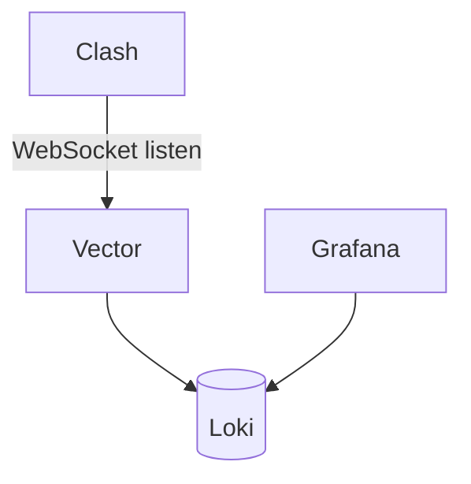
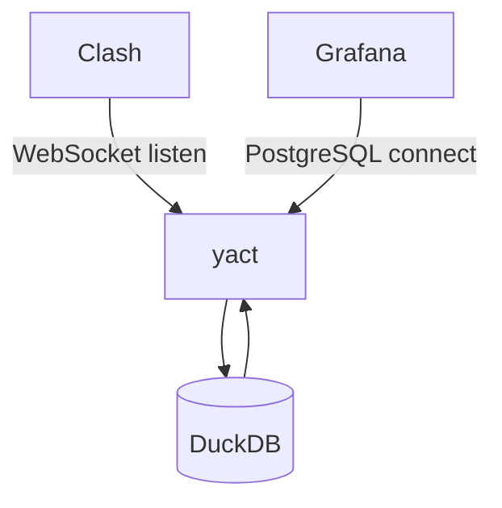

# Yet Another Clash Tracing

Yet
Another [Clash](https://github.com/Dreamacro/clash) [Tracing](https://github.com/Dreamacro/clash-tracing)

## 这是什么

......

### 特性列表

- [ ] 数据加载：日志追加，定时 load（数据时效性 H-1）
- [ ] 数据 TTL 生命周期
- [ ] Grafana 读取 DuckDB

## 快速开始

......

## 实现原理

......

### 架构概览


### 核心流程

Listen to Clash Profile

```
websocat -v ws://127.0.0.1:9090/traffic

websocat -v ws://127.0.0.1:9090/profile/tracing

> type: ["DNSRequest","RuleMatch","ProxyDial"]
```

Dreamacro Clash Tracing



Yet Another Clash Tracing



## 部署安装

......

## FQA

......

## 许可声明

......
